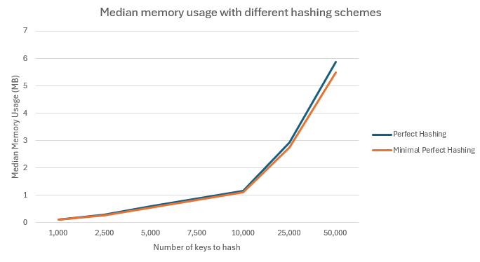
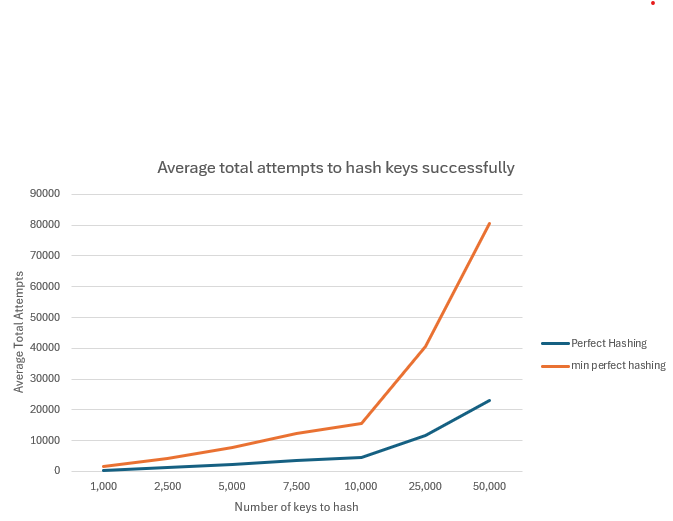

# Perfect Hashing: Performance Analysis of O(n²) vs O(n) Implementations

## Overview

This project implements and benchmarks two perfect hashing algorithms in C: Regular Perfect Hashing (O(n²) space) and Minimal Perfect Hashing (O(n) space). The implementation is based on content from Australian National University's COMP3600 (Algorithms) and Carnegie Mellon University's [Universal and Perfect Hashing Lecture](https://www.cs.cmu.edu/~avrim/451f11/lectures/lect1004.pdf).

## Background

### Hashing Fundamentals

Hashing provides O(1) average-case lookup by mapping keys to array indices using a hash function. A basic hash function takes the form:
```
h(x) = (ax + b) mod p
```

Where `a` and `b` are constants, `x` is the input key, and `p` is a prime number.

### Universal Hashing

Universal hashing reduces collision probability by randomly selecting hash functions from a family. For any pair of keys, the collision probability is ≤ 1/m:
```
h(x) = ((ax + b) mod p) mod m
```

Where `p` is a large prime (p > m), `a` and `b` are random values in [1, p-1], and `m` is the hash table size.

### Perfect Hashing

Perfect hashing eliminates collisions entirely using a two-level scheme:
- **Level 1:** Distribute n keys into n buckets
- **Level 2:** Each bucket uses a secondary hash table sized to guarantee zero collisions

**Regular Perfect Hashing:** Uses O(n²) total space with secondary tables of size k²  
**Minimal Perfect Hashing:** Uses O(n) total space with secondary tables of size k

## Implementation

### Two-Level Hashing Scheme

**Level 1:** Hash n keys into n buckets using universal hashing  
**Level 2:** Each bucket with k keys uses secondary hash table of size m₂
- Regular PH: m₂ = k² (guarantees collision-free in 1-2 attempts)
- MPH: m₂ = k (minimal space, requires multiple retry attempts)

### Universal Hash Function
```
h(x) = ((Σ aᵢ·xᵢ + b) mod p) mod m
```

**Parameters:**
- Prime p = 2,147,483,647 (Mersenne prime M₃₁)
- Random coefficients aᵢ ∈ [1, p-1] per hash function
- Random constant b ∈ [0, p-1]
- Collision probability ≤ 1/m for any key pair

**Design decisions:**
- Fixed coefficient array size at `max_str_len` for variable-length strings
- `unsigned long long` for intermediate computation prevents overflow
- Double modulo ensures uniform distribution

### Construction Algorithm

**Build process:**
1. Distribute n keys into n first-level buckets (O(n) expected)
2. For each bucket with k > 1 keys:
   - Generate random universal hash function
   - Attempt collision-free placement in m₂ slots
   - On collision: regenerate hash parameters and retry
   
**Retry characteristics:**
- Regular PH: 1-2 attempts expected (abundant space)
- MPH: 10-100+ attempts expected (tight space constraint)

### Lookup Operation

**Two-level lookup (O(1) worst-case):**
1. Compute h₁ = hash(key) mod m to find bucket
2. If bucket empty, return not found
3. If bucket has single key, perform direct comparison
4. Compute h₂ = hash(key) mod m₂ for secondary table
5. Compare key at position h₂

**Performance:** Two hash computations + one string comparison per lookup, with no collision resolution required.

### Memory Management

**Space complexity:**
- Regular PH: O(n²) worst-case
- MPH: O(n) 

**Allocation strategy:**
- Level 1: Contiguous allocation for n buckets
- Level 2: Per-bucket allocations for secondary tables
- Hash parameters: Coefficient arrays per table/bucket
- Keys: Pointer storage only (no string duplication)

### Code Organization

**Core functions:**
- `universal_hash()` - Hash computation
- `init_universal_hash()` - Random parameter generation
- `build_first_level_bucketing()` - Initial key distribution
- `build_second_level_bucketing()` - Per-bucket collision-free construction
- `ph_build()` - Main build coordinator with metrics
- `ph_lookup()` - Two-level lookup with edge cases
- `ph_free()` - Memory cleanup

**Tracked metrics:**
- Total hash function attempts
- Maximum attempts for worst-case bucket
- Collision count during construction

## Testing

### Test Suite

The implementation includes automated tests validating:

**Correctness Tests:**
- Basic insertion and lookup for known key sets
- Negative lookups (keys not in table return -1)
- Both algorithms produce identical lookup results

**Stress Tests:**
- Large datasets (1000+ keys)
- All inserted keys successfully retrieved
- No false positives or false negatives

**Edge Cases:**
- Single-key tables
- Two-key tables
- Keys with common prefixes
- Variable-length keys

**Expected output:**
```
=================================
Perfect Hashing - Testing
=================================

Running correctness test...
Basic Correctness Passed!

Running collision-free test...
Collision Test Passed!

Running stress test...
Stress Test Passed!

Running edge case tests...
Edge Cases Passed!

=================================
All Tests Passed!
=================================
```

### Test Validation

All tests validate the perfect hashing guarantee: **zero collisions** in final structure. Each test verifies that every inserted key can be retrieved with a single lookup operation.


## Performance Benchmarking

### Methodology

The benchmarking framework employs rigorous statistical methodology to ensure reliable performance measurements. Each configuration is tested across 10 independent trials, with 3 warmup runs executed beforehand. This is because I noticed that when conducting multiple trials, the first trials always took longer than ones that come after, which could be due to preloaded cache contents for newer trials. All timing measurements use `clock_gettime(CLOCK_MONOTONIC)` for nanosecond-precision.

The benchmark suite measures four primary metrics: build time (hash table construction from key insertion to completion), lookup latency (per-key retrieval time), memory footprint (exact byte-level accounting of all allocated structures), and build efficiency (the number of hash function generation attempts required). Statistical analysis computes the median, 95th percentile, 99th percentile, and standard deviation across all trials, providing both central tendency and tail behavior characterisation.

Test configurations span dataset sizes from 1,000 to 50,000 keys, using randomly generated strings of 50 characters composed of lowercase letters (a-z). Note that I would've gone to much larger dataset sizes, but my laptop couldn't handle it. Each key is unique within its dataset, verified through ```key_set_cleaner()```. This ensures the perfect hashing algorithms operate on valid input that matches real-world use cases (and to also avoid infinite loops we can find in ```build_second_level_bucketing()```). 


### Lookup Performance

**Average Lookup Time (ns)**

| Hashing Type    | 1,000 | 2,500 | 5,000 | 7,500 | 10,000 | 25,000 | 50,000 |
| --------------- | ----- | ----- | ----- | ----- | ------ | ------ | ------ |
| Perfect Hashing | 48    | 53    | 61    | 70    | 73     | 92     | 136    |
| Min Perfect     | 52    | 62    | 78    | 84    | 102    | 132    | 202    |

Both implementations demonstrate the expected $O(1)$ constant time lookup complexity. Regardless of whether the data set contains 10,000 or 50,000 keys, the algorithm always performs exactly two computations and one string comparison. However, we do observe two distinct trends: 
- Cache Latency Growth: The gradual increase in lookup time is not due to algorithmic complexity but rather CPU cache hierarchy effects. As the dataset size increases, the CPU incurs more cache misses, adding more memory fetch latency to the operation. 
- MPH Performance Penalty: MPH is consistently slower than PH. This counter intuitive result could be due to memory alignment. The 'wasted' space in PH may be acting as pseudo-padding that aligns the data structures, optimising CPU operations unlike the tightly-packed MPH structure.    

### Memory Usage

**Average Memory Usage Per Key (bytes)**
| Hashing Type    | 1,000  | 2,500  | 5,000  | 7,500  | 10,000 | 25,000 | 50,000 |
| --------------- | ------ | ------ | ------ | ------ | ------ | ------ | ------ |
| Perfect Hashing | 123.64 | 123.47 | 123.11 | 123.77 | 123.06 | 123.2  | 123.22 |
| Min Perfect     | 116.08 | 115.24 | 115.3  | 115.13 | 115.43 | 115.15 | 115.05 |

Notice how memory usage per key remains relatively constant for all key set sizes. This follows expectations as it is unreasonable to predict that as key set sizes increase, the amount of space each key uses is changed; linear space complexity $O(n)$. 

Minimal Perfect Hashing uses about 8 bytes less than Perfect Hashing in most cases. Recall that MPH and PH both share the same first level bucketing schemes, but vary in the second level. The consistent 8 bytes is an indication that PH reserves structural memory that MPH successfully eliminates or compresses. My theory says that the 8 bytes most likely attribute to one of the following: 
- Secondary Hash Function Parameters: In a two level scheme, every non empty bucket requires a unique hash function $h_i$. We use two random 32-bit integer seeds $a$ and $b$ that require 8 bytes together. 
- Memory Padding: The C compiler could be consistently inserting 8 bytes of memory padding into the block to ensure alignment of internal attributes. 
- Structural Redundancy: There may just be some redundant 8 bytes of information that appears only when performing MPH, in which case, my implementation is the main issue.    

**Median Memory Usage** 
| Hashing Type    | 1,000 | 2,500 | 5,000 | 7,500 | 10,000 | 25,000 | 50,000 |
| --------------- | ----- | ----- | ----- | ----- | ------ | ------ | ------ |
| Perfect Hashing | 0.12  | 0.29  | 0.59  | 0.89  | 1.17   | 2.94   | 5.88   |
| Min Perfect     | 0.11  | 0.27  | 0.55  | 0.82  | 1.1    | 2.75   | 5.49   |



This provides a macro-view of the system's memory footprint, confirming linear space complexity for both $O(N)$ algorithms. 
- Scalability: Memory usage scales just as expected; linearly. For example, increasing keys from 5,000 to 50,000 results in an almost 10x memory usage increase for both PH and MPH. 
- Tradeoff: While the per-key analysis showed 8 byte saving, the total system impact seems to show that MPH saves about 400 KB of space in comparison to PH. 


### Build Efficiency

**Average Build Time (ms)**

| Hashing Type    | 1,000 | 2,500 | 5,000 | 7,500 | 10,000 | 25,000 | 50,000 |
| --------------- | ----- | ----- | ----- | ----- | ------ | ------ | ------ |
| Perfect Hashing | 0.269 | 0.705 | 1.33  | 2.13  | 2.94   | 7.84   | 17.81  |
| Min Perfect     | 0.601  | 1.70  | 3.35  | 5.04  | 6.82   | 18.17  | 42.69  |


I will not be going too much into build time as it ties into build attempts directly. This information is given so that the reader can compare the two tables directly  for more clarification. 

**Build Latency and Variability (p99 Analysis)** 

Note that this is a new trial taken on a different day and so values  may be shifted slightly in comparison to the previous table. 

| Hashing Type | Key Count | Median (p50) | p99 Build Time | Std Dev |
|-------------|-----------|--------------|----------------|---------|
| PH          | 1,000     | 0.276        | 0.289          | 0.022   |
| MPH         | 1,000     | 0.623        | 0.813          | 0.131   |
| PH          | 10,000    | 2.707        | 2.928          | 0.144   |
| MPH         | 10,000    | 6.315        | 6.999          | 0.247   |
| PH          | 50,000    | 18.678       | 21.155         | 2.585   |
| MPH         | 50,000    | 49.406       | 50.78          | 2.81    |

Notice that MPH is less predictable. At 1,000 keys, the standard deviation for MPH is about 6 times higher than for regular PH, but the same cannot bbe said for other key count sizes. In fact, the standard deviation   never stays consistent. This high variability shows how unstable randomised build process can be. The algorithm seems to have hit unlucky random seeds in our first case, causing it to spend significantly more time searching for a perfect map. 

Worst case latency (p99) is highly predictable for PH, as it always remains somewhat close to the median; minimal overhead. MPH suffers from slightly greater tail latency (in most cases). Exponential difficulty of resolving heavy buckets translates to a catastrophic worse-case time building for 1% of the trials. 

Notice that in this table, 50,000 keys with MPH performs far better than expected. This is an outlier. Rerunning this key set size resulted in far greater gaps most of the time. I only included this sample because I wanted to show how randomness can effect performance in both positive and negative ways. You may experiment around with the same inputs as me and see if you get similar results. 


**Average Total Attempts To Build Perfect Hash Table**
| Hashing Type    | 1,000 | 2,500  | 5,000   | 7,500   | 10,000 | 25,000  | 50,000  |
| --------------- | ----- | ------ | ------- | ------- | ------ | ------- | ------- |
| Perfect Hashing | 447.8 | 1162.9 | 2273.7  | 3483.8  | 4658.6 | 11542.9 | 23047.3 |
| Min Perfect     | 1650  | 4127.6 | 7847    | 12268.6 | 15562.2 | 40646  | 80657.8 |




Even just buy observation, we can see that MPH schemes take significantly more attempts on average to create a complete hash table. As explained earlier, this is because MPH performs second level hashing using a smaller table size $n$ instead of $n^2$, hence the 'margin of error' of hashing is far smaller and will require more attempts to find the right hashing functions. 

Notice that after 10,000 keys, the MPH scheme attempt amount sky rockets at a much steeper angle in comparison to regular PH. This could be due to the following: 
- Heavy Buckets: At larger key set sizes, the probability of a single bucket on the first level having multiple keys increases. This is because our hashing function can reproduce the same values more often. Heavier buckets are harder to deal with in MPH in comparison to PH as there is less wiggle room (size $n$ vs $n^2$). 

As of right now, I cannot really think of other reasons. Will come back to this one day.  

It is important to note that this data is semi-incomplete, as we only have two data points past 10,000 keys to work with. Take the previous conclusions/arguments with a grain of salt. The reason why there aren't more data points is because my computer simply took to long to run them. 


### (Theoretical) Cache Miss Rates

Note that I couldn't measure direct cache miss rates since I was running this on WSL, not an actual Linux device. This is just pure theory and what is to be expected from my program and not the actual results. Remnants of my cache miss rate code can  still be found in the ```benchmarks``` directory. 

**Read/Lookup Miss Rate** 

The cache miss rate during a lookup operation will be nearly identical and optimally low for both implementations:
- Access Scheme: Both schemes require exactly two memory lookups to find a given key; one to Level 1 and one to Level 2.
- Locality: Both MPH and PH exhibit high spacial locality since data accessed in both levels are 'highly concentrated'. Note that spacial locality is a fragment of most caching schemes and helps decide which information is best to store in cache memory. It says that "programs tend to access memory locations near those that have  recently been accessed". 

For the read-heavy workloads that perfect hashing is designed for, PH and MPH provide almost optimal $O(1)$ lookup performance and should have a low, constant theoretical cache miss rate. 

**Write/Construction Miss Rate** 

The cache miss rate during hash table construction is where PH and MPH differ significantly. 

MPH is far less efficient at building in comparison to PH as explained earlier. Each failed attempt at building forces the algorithm to re-read and re-write the Level 2 array with new hash parameters. Since these attempts are random, they cause frequent cache thrashing, where old evicted cache data is replaced with the same data again in the new cycle. The higher number of attempts should translate directly into a significantly higher cache miss rate during building. 

PH has a far lower build failure rate due to its oversized nature. The construction phase completes before the high volume of random memory can induce serious cache thrashing. The write-access scheme is much shorter and more localised, and should lead to a low and predictable cache miss rate. 

## Conclusion 
The performance analysis clearly defined two trade offs between the hashing schemes: 
- PH $O(n^2)$: Prioritises predictability and stability. It guarantees a low, stable, built time but at the cost for higher memory space requirements; approximately 8 bytes per key more than MPH. 
- MPH $O(n)$: Prioritises memory efficiency. It saves small but consistent amount of memory, but requires a lot more build time on average and highly unpredictable due to exponential search difficulty required to resolve heavy buckets.   

For General Purpose Systems (e.g., high-throughput web service rule matching), the build stability of PH is the far better choice, as the risk of catastrophic p99 build latency outweighs the insignificant memory savings. MPH is best reserved for memory starved environments, such as embedded systems or massive, static datasets where an aggressive reduction in memory footprint is economically viable.

## Running The Code

```bash
make 
./test_hashing_correctness
./benchmark [num_keys] [key_len]
# Example: benchmark with 10,000 keys of length 50
./benchmark 10000 50
```

The program for benchmarking outputs detailed statistics for both Regular Perfect Hashing and Minimal Perfect Hashing, including per-trial results and aggregate statistics across all measured metrics.